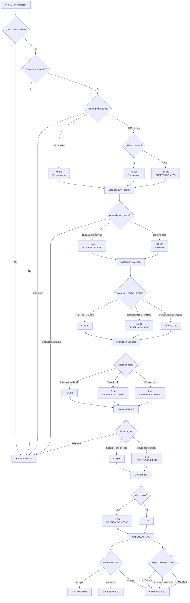
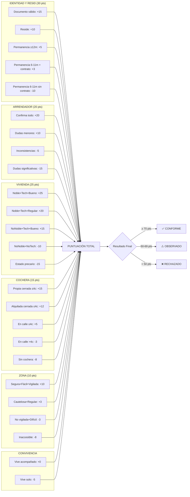
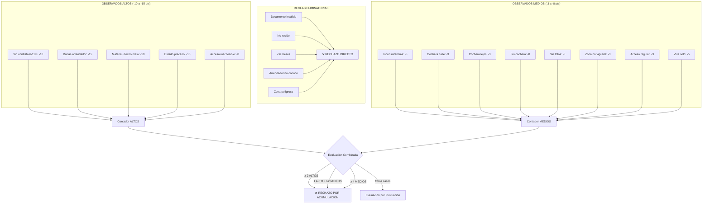

# Diagramas de Flujo - Visita Domiciliaria

## Flujo Principal



## Flujo de Puntuación



## Matriz de Decisión



## Para generar estos diagramas visualmente:

### Opción 1: GitHub/GitLab
- Copia el código Mermaid en un archivo `.md`
- GitHub y GitLab renderizan automáticamente los diagramas Mermaid

### Opción 2: Herramientas Online
- **Mermaid Live Editor**: https://mermaid.live/
- **Draw.io**: Importa diagramas Mermaid
- **Lucidchart**: Soporta importación Mermaid

### Opción 3: VS Code
- Instala la extensión "Mermaid Preview"
- Visualiza los diagramas directamente en el editor

### Opción 4: Generar imágenes
```bash
# Usando mermaid-cli
npm install -g @mermaid-js/mermaid-cli
mmdc -i flujo_principal.mmd -o flujo_principal.png
```
