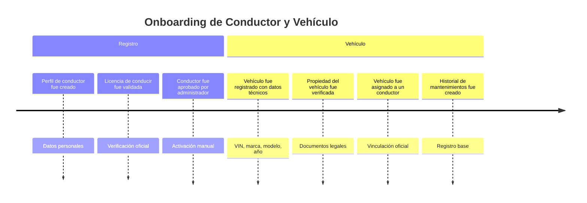
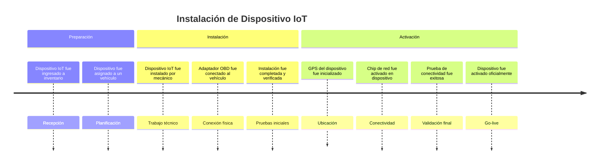
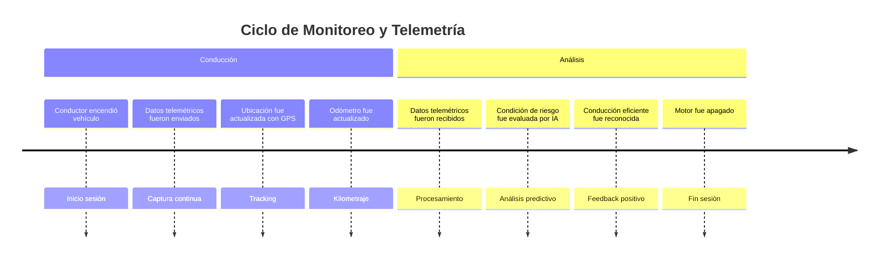
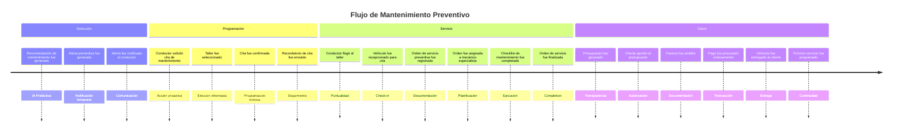
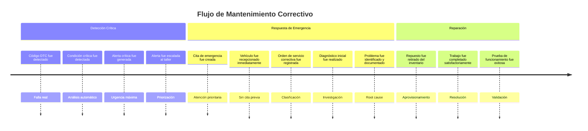
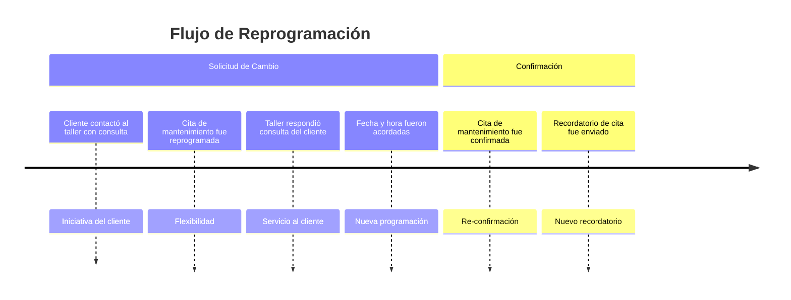
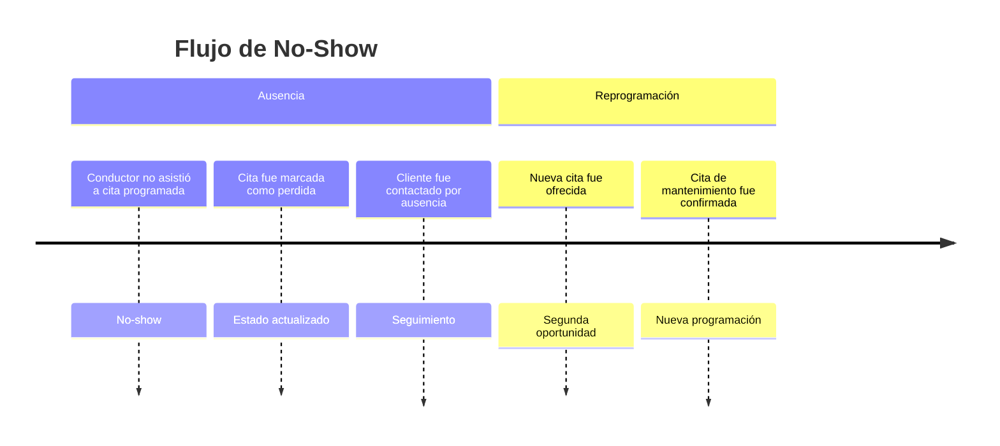
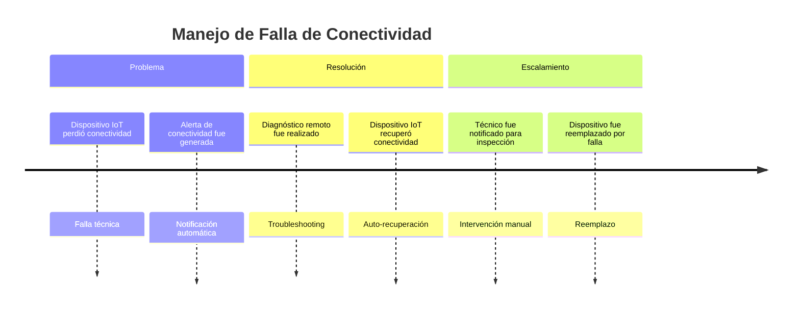
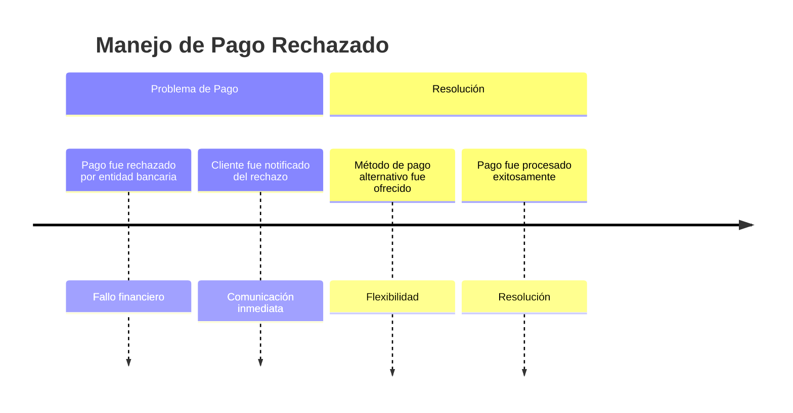
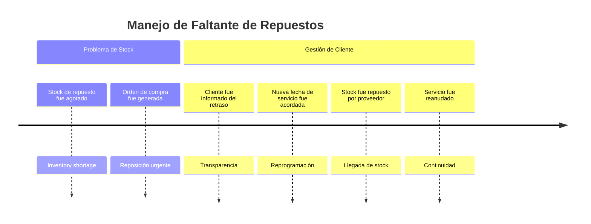

# SafeCar EventStorming - Step 2: Timeline Organization

## Introducción

En esta segunda fase del EventStorming, organizamos los **eventos de dominio** en **secuencias temporales** que reflejen el orden real en que ocurren en el negocio. 

Comenzamos con el **happy path** (flujo exitoso) y luego agregamos **escenarios alternativos** y **casos excepcionales**.

---

## 🎯 Happy Path: Flujo Principal de SafeCar

### 1. Onboarding Inicial

**Secuencia de Eventos:**
1. **Perfil de conductor fue creado con datos personales y de contacto**
2. **Licencia de conducir fue validada**
3. **Conductor fue aprobado por administrador**
4. **Vehículo fue registrado con datos técnicos (VIN, marca, modelo, año)**
5. **Propiedad del vehículo fue verificada**
6. **Vehículo fue asignado a un conductor**
7. **Historial de mantenimientos del vehículo fue creado**

### 2. Instalación y Configuración IoT

**Secuencia de Eventos:**
8. **Dispositivo IoT fue ingresado a inventario**
9. **Dispositivo IoT fue etiquetado con identificador único**
10. **Dispositivo fue asignado a un vehículo**
11. **Dispositivo IoT fue instalado en un vehículo por un mecánico**
12. **Adaptador OBD fue conectado al vehículo**
13. **GPS del dispositivo fue inicializado**
14. **Chip del proveedor de red fue activado en el dispositivo**
15. **Prueba de conectividad del dispositivo fue completada exitosamente**
16. **Claves de cifrado de dispositivo fueron provisionadas**
17. **Dispositivo fue activado oficialmente**

### 3. Operación Normal - Ciclo de Monitoreo

**Secuencia de Eventos:**
18. **Conductor encendió vehículo**
19. **Datos telemétricos fueron enviados por el dispositivo IoT**
20. **Datos telemétricos fueron recibidos por la plataforma**
21. **Datos telemétricos fueron validados**
22. **Ubicación del vehículo fue actualizada con datos GPS**
23. **Odómetro fue actualizado con base en telemetría**
24. **Condición de riesgo fue evaluada por la IA**
25. **Conducción eficiente fue reconocida**
26. **Motor fue apagado por conductor**

### 4. Mantenimiento Preventivo - Happy Path

**Secuencia de Eventos:**
27. **Recomendación de mantenimiento preventivo fue generada**
28. **Alerta preventiva fue generada**
29. **Alerta fue notificada al conductor**
30. **Alerta fue reconocida por el conductor**
31. **Conductor solicitó cita de mantenimiento**
32. **Taller fue seleccionado para la cita**
33. **Cita de mantenimiento fue creada**
34. **Cita de mantenimiento fue confirmada**
35. **Recordatorio de cita fue enviado**
36. **Conductor llegó al taller**
37. **Vehículo fue recepcionado para cita**
38. **Orden de servicio preventiva fue registrada**
39. **Orden de servicio fue asignada a un mecánico**
40. **Orden de servicio fue iniciada**
41. **Checklist de mantenimiento fue completado**
42. **Control de calidad fue realizado**
43. **Orden de servicio fue finalizada**
44. **Presupuesto fue generado automáticamente**
45. **Cliente aprobó el presupuesto**
46. **Factura fue emitida al cliente**
47. **Pago fue procesado exitosamente**
48. **Vehículo fue entregado al cliente**
49. **Garantía fue otorgada por el servicio**
50. **Próximo servicio fue programado**
51. **Historial de mantenimientos del vehículo fue actualizado**

---

## 🔀 Escenarios Alternativos

### Escenario A: Mantenimiento Correctivo (Falla Detectada)

**Trigger:** Condición crítica detectada durante operación normal

**Secuencia de Eventos Alternativos:**
- **Código de diagnóstico DTC fue detectado**
- **Condición crítica fue detectada**
- **Alerta crítica fue generada**
- **Alerta fue escalada automáticamente al taller**
- **Cita de emergencia fue creada**
- **Vehículo fue recepcionado inmediatamente**
- **Orden de servicio correctiva fue registrada**
- **Diagnóstico inicial fue realizado**
- **Problema fue identificado y documentado**
- **Repuesto fue retirado del inventario para servicio**
- **Trabajo fue completado satisfactoriamente**
- **Prueba de funcionamiento fue exitosa**
- *(Continúa con facturación normal)*

### Escenario B: Reprogramación de Cita

**Trigger:** Cliente necesita cambiar fecha de cita ya programada

**Secuencia de Eventos Alternativos:**
- **Cliente contactó al taller con consulta**
- **Cita de mantenimiento fue reprogramada**
- **Taller respondió consulta del cliente**
- **Fecha y hora fueron acordadas** (nueva fecha)
- **Cita de mantenimiento fue confirmada** (re-confirmación)
- **Recordatorio de cita fue enviado** (actualizado)
- *(Continúa con flujo normal de servicio)*

### Escenario C: No-Show del Cliente

**Trigger:** Cliente no asiste a cita programada

**Secuencia de Eventos de No-Show:**
- **Conductor no asistió a la cita programada (no-show)**
- **Cliente fue contactado por ausencia**
- **Nueva cita fue ofrecida**
- **Cita de mantenimiento fue confirmada** (reprogramada)
- *(O alternativamente: Cita fue cancelada)*

---

## ⚠️ Casos Excepcionales

### Excepción 1: Falla de Conectividad IoT

**Secuencia de Eventos Excepcionales:**
- **Dispositivo IoT perdió conectividad**
- **Prueba de conectividad del dispositivo falló**
- **Técnico fue notificado para inspección**
- **Diagnóstico remoto fue realizado**
- **Dispositivo IoT recuperó conectividad** *(Si auto-recupera)*
  
  **O alternativamente:**
- **Dispositivo fue marcado para reemplazo**
- **Nuevo dispositivo fue asignado automáticamente**
- **Dispositivo fue reemplazado por falla**
- **Dispositivo fue activado oficialmente** *(nuevo)*

### Excepción 2: Pago Rechazado

**Secuencia de Eventos de Pago:**
- **Pago fue rechazado por entidad bancaria**
- **Cliente fue notificado del rechazo**
- **Método de pago alternativo fue ofrecido**
- **Pago con tarjeta fue procesado** *(método alternativo)*
- **Pago fue procesado exitosamente**
- **Factura fue pagada completamente**

### Excepción 3: Stock Insuficiente de Repuestos

**Secuencia de Eventos de Inventario:**
- **Repuestos fueron solicitados para la orden**
- **Stock de repuesto fue agotado**
- **Orden de compra de repuestos fue generada**
- **Cliente fue informado del retraso estimado**
- **Nueva fecha de servicio fue acordada**
- **Stock de repuesto fue repuesto por proveedor**
- **Repuesto fue retirado del inventario para servicio**
- *(Continúa con ejecución normal del servicio)*

---

## 📊 Análisis de Patrones Temporales

### Patrones Identificados:

**🔄 Ciclos Recurrentes:**
1. **Conducción → Telemetría → Análisis → (Opcional) Alerta**
2. **Alerta → Cita → Servicio → Pago → Programación siguiente**
3. **Inventario → Agotamiento → Reposición → Disponibilidad**

**⚡ Triggers Principales:**
- **Tiempo**: Mantenimiento preventivo programado
- **Eventos IoT**: Códigos DTC, parámetros fuera de rango
- **Acción del usuario**: Solicitud de cita, cambios, consultas
- **Sistema**: Algoritmos de IA, vencimientos, niveles de stock

**🎯 Puntos de Decisión Críticos:**
1. **Post-Alerta**: ¿Conductor actúa proactivamente?
2. **Post-Diagnóstico**: ¿Servicio preventivo o correctivo?
3. **Post-Presupuesto**: ¿Cliente autoriza servicios adicionales?
4. **Post-Falla Técnica**: ¿Auto-recuperación o intervención manual?

### Preparación para Step 3:

**Bounded Contexts Emergentes:**
- **Gestión de Perfiles**: Usuario-centric
- **Vehículos e IoT**: Asset-centric  
- **Telemetría y Análisis**: Data-centric
- **Servicios y Órdenes**: Process-centric
- **Facturación**: Transaction-centric

**Agregados Potenciales:**
- **Conductor + Vehículos**: Ownership aggregate
- **Dispositivo IoT + Telemetría**: Monitoring aggregate
- **Cita + Orden de Servicio**: Service aggregate
- **Inventario + Repuestos**: Stock aggregate

---

*SafeCar EventStorming Step 2 - Timeline Organization*  
*✅ COMPLETADO - Flujos Temporales Identificados*  
*Preparado para Step 3: Identificación de Pain Points*