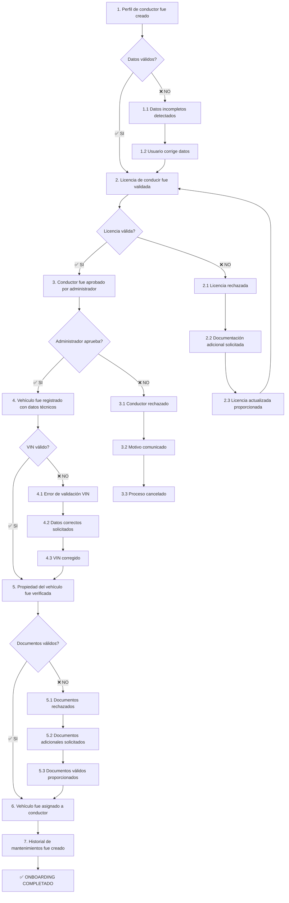
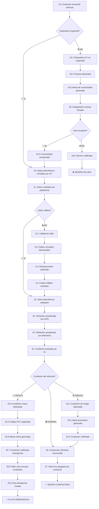
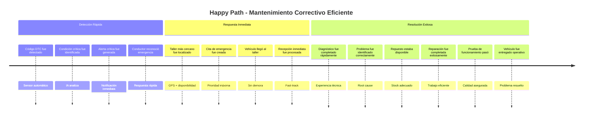
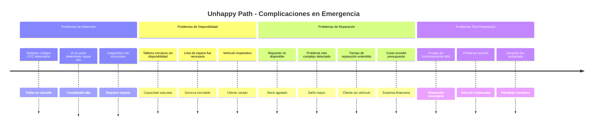
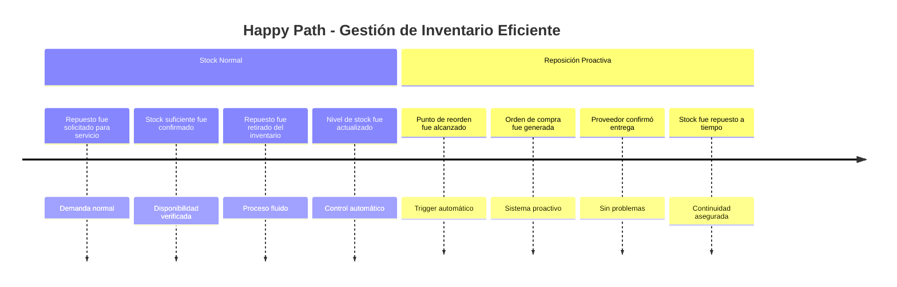
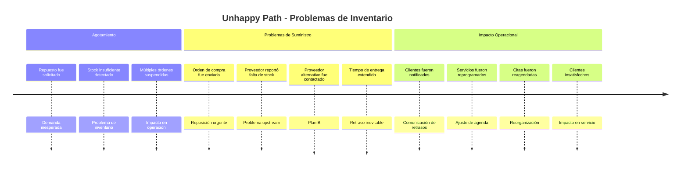

```mermaid
flowchart TD
    A[8. Dispositivo IoT solicitado para instalación] --> B{Stock disponible?}
    B -->|✅ SI| C[9. Dispositivo IoT ingresado a inventario]
    B -->|❌ NO| B1[8.1 Stock insuficiente detectado] --> B2[8.2 Orden de compra generada] --> B3[8.3 Cliente notificado del retraso] --> B4[8.4 Nueva fecha acordada] --> B5[8.5 Stock repuesto] --> C
    
    C --> D[10. Dispositivo etiquetado con ID único]
    D --> E[11. Dispositivo asignado a vehículo]
    E --> F[12. Dispositivo instalado por mecánico]
    F --> G{Puerto OBD funcional?}
    G -->|✅ SI| H[13. Adaptador OBD conectado exitosamente]
    G -->|❌ NO| G1[12.1 Adaptador OBD falló] --> G2[12.2 Puerto inspeccionado] --> G3[12.3 Daño identificado] --> G4[12.4 Puerto reparado] --> H
    
    H --> I[14. GPS del dispositivo inicializado]
    I --> J{GPS obtiene señal?}
    J -->|✅ SI| K[15. Chip de red activado]
    J -->|❌ NO| J1[14.1 GPS falló inicialización] --> J2[14.2 Reubicación de dispositivo] --> K
    
    K --> L{Conectividad establecida?}
    L -->|✅ SI| M[16. Prueba de conectividad exitosa]
    L -->|❌ NO| L1[15.1 Chip no activó] --> L2[15.2 Problema de proveedor] --> L3[15.3 Chip reemplazado] --> M
    
    M --> N{Pruebas pasan?}
    N -->|✅ SI| O[17. Claves de cifrado provisionadas]
    N -->|❌ NO| N1[16.1 Prueba falló] --> N2[16.2 Diagnóstico realizado] --> N3[16.3 Dispositivo defectuoso] --> N4[16.4 Dispositivo reemplazado] --> O
    
    O --> P[18. Dispositivo activado oficialmente]
    P --> Q[✅ INSTALACIÓN COMPLETADA]
```

```mermaid
flowchart TD
    A[28. Recomendación de mantenimiento generada] --> B[29. Alerta preventiva generada]
    B --> C{Conductor responde?}
    C -->|✅ SI| D[30. Alerta reconocida por conductor]
    C -->|❌ NO| C1[29.1 Alerta ignorada] --> C2[29.2 Recordatorio enviado] --> C3{Segunda respuesta?}
    C3 -->|✅ SI| D
    C3 -->|❌ NO| C4[29.3 Segunda alerta ignorada] --> C5[29.4 Condición empeoró] --> C6[29.5 Alerta crítica generada] --> D
    
    D --> E[31. Conductor solicitó cita]
    E --> F{Disponibilidad?}
    F -->|✅ SI| G[32. Taller seleccionado]
    F -->|❌ NO| F1[31.1 Sin disponibilidad] --> F2[31.2 Lista de espera] --> F3[31.3 Cita reprogramada] --> F4[31.4 Cliente notificado retraso] --> G
    
    G --> H[33. Cita confirmada]
    H --> I[34. Recordatorio enviado]
    I --> J{Cliente asiste?}
    J -->|✅ SI| K[35. Conductor llegó puntualmente]
    J -->|❌ NO| J1[34.1 No-show detectado] --> J2[34.2 Cliente contactado] --> J3[34.3 Motivo consultado] --> J4[34.4 Nueva cita ofrecida] --> J5{Acepta nueva cita?}
    J5 -->|✅ SI| H
    J5 -->|❌ NO| CANCEL[❌ CITA CANCELADA]
    
    K --> L[36. Vehículo recepcionado]
    L --> M[37. Orden de servicio registrada]
    M --> N[38. Orden asignada a mecánico]
    N --> O[39. Inspección inicial realizada]
    O --> P{Problemas adicionales?}
    P -->|❌ NO| Q[40. Checklist básico completado]
    P -->|✅ SI| P1[39.1 Problemas adicionales encontrados] --> P2[39.2 Diagnóstico completo] --> P3[39.3 Presupuesto adicional] --> P4[39.4 Cliente contactado] --> P5{Cliente aprueba?}
    P5 -->|✅ SI| P6[39.5 Trabajo completo autorizado] --> Q
    P5 -->|❌ NO| P7[39.6 Solo mantenimiento básico] --> Q
    
    Q --> R[41. Control de calidad realizado]
    R --> S{QC pasa?}
    S -->|✅ SI| T[42. Orden finalizada]
    S -->|❌ NO| S1[41.1 QC falló] --> S2[41.2 Retrabajo requerido] --> S3[41.3 Corrección realizada] --> T
    
    T --> U[43. Presupuesto generado]
    U --> V[44. Cliente aprueba presupuesto]
    V --> W[45. Factura emitida]
    W --> X[46. Pago procesado]
    X --> Y{Pago exitoso?}
    Y -->|✅ SI| Z[47. Vehículo entregado]
    Y -->|❌ NO| Y1[46.1 Pago rechazado] --> Y2[46.2 Cliente notificado] --> Y3[46.3 Método alternativo solicitado] --> Y4[46.4 Pago alternativo procesado] --> Y5{Segundo pago OK?}
    Y5 -->|✅ SI| Z
    Y5 -->|❌ NO| Y6[46.5 Vehículo retenido] --> Y7[46.6 Negociación de pago] --> Z
    
    Z --> AA[48. Garantía otorgada]
    AA --> BB[49. Próximo servicio programado]
    BB --> CC[50. Historial actualizado]
    CC --> DD[✅ SERVICIO COMPLETADO]
```

# SafeCar EventStorming - Step 2: Timeline Organization

## Introducción

En esta segunda fase del EventStorming, organizamos los **eventos de dominio** en **secuencias temporales** que reflejen el orden real en que ocurren en el negocio. 

Comenzamos con el **happy path** (flujo exitoso) y luego agregamos **escenarios alternativos** y **casos excepcionales**.

---

## 🎯 FLUJO 1: Onboarding de Conductor y Vehículo

### Flujo Secuencial Integrado con Alternativas

**Secuencia Integrada con Puntos de Decisión:**

**Flujo Principal:**
1. **Perfil de conductor fue creado con datos personales y de contacto**
   - *🔀 ¿Datos completos y válidos?*
     - **✅ SI**: Continúa al paso 2
     - **❌ NO**: 1.1 → 1.2 → vuelve a paso 1

2. **Licencia de conducir fue validada**
   - *🔀 ¿Licencia vigente y válida?*
     - **✅ SI**: Continúa al paso 3
     - **❌ NO**: 2.1 → 2.2 → 2.3 → vuelve a paso 2

3. **Conductor fue aprobado por administrador**
   - *🔀 ¿Administrador aprueba?*
     - **✅ SI**: Continúa al paso 4
     - **❌ NO**: 3.1 → 3.2 → 3.3 → **FIN (Cancelado)**

4. **Vehículo fue registrado con datos técnicos (VIN, marca, modelo, año)**
   - *🔀 ¿VIN válido y datos correctos?*
     - **✅ SI**: Continúa al paso 5
     - **❌ NO**: 4.1 → 4.2 → 4.3 → vuelve a paso 5

5. **Propiedad del vehículo fue verificada**
   - *🔀 ¿Documentos de propiedad válidos?*
     - **✅ SI**: Continúa al paso 6
     - **❌ NO**: 5.1 → 5.2 → 5.3 → vuelve a paso 6

6. **Vehículo fue asignado a un conductor**
7. **Historial de mantenimientos del vehículo fue creado**

**Rutas Alternativas Detalladas:**

**Ruta 1.1-1.2**: Datos Incompletos
- 1.1 **Datos incompletos fueron detectados**
- 1.2 **Usuario fue notificado y corrigió datos**

**Ruta 2.1-2.3**: Licencia Inválida
- 2.1 **Licencia de conducir fue rechazada por estar vencida**
- 2.2 **Documentación adicional fue solicitada**
- 2.3 **Licencia actualizada fue proporcionada**

**Ruta 3.1-3.3**: Rechazo Administrativo
- 3.1 **Conductor fue rechazado por administrador**
- 3.2 **Motivo del rechazo fue comunicado**
- 3.3 **Proceso de onboarding fue cancelado**

**Ruta 4.1-4.3**: VIN Inválido
- 4.1 **Error de validación de VIN fue detectado**
- 4.2 **Datos correctos fueron solicitados al usuario**
- 4.3 **Vehículo fue registrado con datos técnicos corregidos**

**Ruta 5.1-5.3**: Documentos Inválidos
- 5.1 **Propiedad del vehículo fue rechazada**
- 5.2 **Documentos adicionales fueron solicitados**
- 5.3 **Documentos válidos fueron proporcionados**

## 🔧 FLUJO 2: Instalación y Configuración IoT

### Flujo Secuencial Integrado con Alternativas

**Secuencia Integrada con Puntos de Decisión:**

**Flujo Principal:**
8. **Dispositivo IoT fue solicitado para instalación**
   - *🔀 ¿Hay stock disponible?*
     - **✅ SI**: Continúa al paso 9
     - **❌ NO**: 8.1 → 8.2 → 8.3 → 8.4 → 8.5 → continúa

9. **Dispositivo IoT fue ingresado a inventario**
10. **Dispositivo IoT fue etiquetado con identificador único**
11. **Dispositivo fue asignado a un vehículo**
12. **Dispositivo IoT fue instalado por un mecánico**
    - *🔀 ¿Puerto OBD funcional?*
      - **✅ SI**: Continúa al paso 13
      - **❌ NO**: 12.1 → 12.2 → 12.3 → 12.4 → continúa

13. **Adaptador OBD fue conectado al vehículo exitosamente**
14. **GPS del dispositivo fue inicializado**
    - *🔀 ¿GPS obtiene señal?*
      - **✅ SI**: Continúa al paso 15
      - **❌ NO**: 14.1 → 14.2 → continúa

15. **Chip del proveedor de red fue activado en el dispositivo**
    - *🔀 ¿Conectividad establecida?*
      - **✅ SI**: Continúa al paso 16
      - **❌ NO**: 15.1 → 15.2 → 15.3 → continúa

16. **Prueba de conectividad del dispositivo fue completada**
    - *🔀 ¿Todas las pruebas pasan?*
      - **✅ SI**: Continúa al paso 17
      - **❌ NO**: 16.1 → 16.2 → 16.3 → 16.4 → continúa

17. **Claves de cifrado de dispositivo fueron provisionadas**
18. **Dispositivo fue activado oficialmente**

**Rutas Alternativas Detalladas:**

**Ruta 8.1-8.5**: Sin Stock
- 8.1 **Stock insuficiente fue detectado**
- 8.2 **Orden de compra de dispositivos fue generada**
- 8.3 **Cliente fue notificado del retraso estimado**
- 8.4 **Nueva fecha de instalación fue acordada**
- 8.5 **Stock de dispositivos fue repuesto por proveedor**

**Ruta 12.1-12.4**: Puerto OBD Dañado
- 12.1 **Adaptador OBD falló al conectarse**
- 12.2 **Puerto OBD del vehículo fue inspeccionado**
- 12.3 **Daño en puerto OBD fue identificado**
- 12.4 **Puerto OBD fue reparado**

**Ruta 14.1-14.2**: GPS Sin Señal
- 14.1 **GPS falló en inicialización**
- 14.2 **Reubicación de dispositivo fue realizada**

**Ruta 15.1-15.3**: Problema de Conectividad
- 15.1 **Chip de red no activó**
- 15.2 **Problema de proveedor fue identificado**
- 15.3 **Chip de red fue reemplazado**

**Ruta 16.1-16.4**: Dispositivo Defectuoso
- 16.1 **Prueba de conectividad falló**
- 16.2 **Diagnóstico de dispositivo fue realizado**
- 16.3 **Dispositivo fue identificado como defectuoso**
- 16.4 **Dispositivo defectuoso fue reemplazado**

## 📡 FLUJO 3: Operación Normal - Monitoreo Continuo

### Flujo Secuencial Integrado con Alternativas

**Secuencia Integrada con Puntos de Decisión:**

**Flujo Principal:**
19. **Conductor encendió vehículo**
    - *🔀 ¿Dispositivo IoT responde?*
      - **✅ SI**: Continúa al paso 20
      - **❌ NO**: 19.1 → 19.2 → 19.3 → 19.4 → 19.5 o falla

20. **Datos telemétricos fueron enviados por el dispositivo IoT**
21. **Datos telemétricos fueron recibidos por la plataforma**
    - *🔀 ¿Datos son válidos?*
      - **✅ SI**: Continúa al paso 22
      - **❌ NO**: 21.1 → 21.2 → 21.3 → 21.4 → continúa

22. **Datos telemétricos fueron validados exitosamente**
23. **Ubicación del vehículo fue actualizada con datos GPS**
24. **Odómetro fue actualizado con base en telemetría**
25. **Condición de riesgo fue evaluada por la IA**
    - *🔀 ¿Cuál es la condición del vehículo?*
      - **🟢 NORMAL**: Continúa al paso 26
      - **🟡 RIESGO**: 25.1 → 25.2 → 25.3 → continúa al paso 26
      - **🔴 CRÍTICA**: 25.4 → 25.5 → 25.6 → 25.7 → 25.8 → 25.9 → **EMERGENCIA**

26. **Conducción eficiente fue reconocida** *(si aplicable)*
27. **Motor fue apagado por conductor**

**Rutas Alternativas Detalladas:**

**Ruta 19.1-19.6**: Falla de Conectividad
- 19.1 **Dispositivo IoT no respondió**
- 19.2 **Timeout de comunicación fue detectado**
- 19.3 **Alerta de conectividad fue generada**
- 19.4 **Diagnóstico remoto fue iniciado**
- 19.5 **Dispositivo IoT recuperó conectividad** *(auto-recuperación)*
  - O alternativamente: 19.6 **Técnico fue notificado para inspección**

**Ruta 21.1-21.4**: Datos Corruptos
- 21.1 **Validación de datos falló por corrupción**
- 21.2 **Datos corruptos fueron descartados**
- 21.3 **Solicitud de retransmisión fue enviada**
- 21.4 **Datos telemétricos válidos fueron recibidos**

**Ruta 25.1-25.3**: Condición de Riesgo
- 25.1 **Condición de riesgo fue detectada**
- 25.2 **Alerta preventiva fue generada**
- 25.3 **Conductor fue notificado del riesgo**

**Ruta 25.4-25.9**: Condición Crítica
- 25.4 **Condición crítica fue detectada por la IA**
- 25.5 **Código de diagnóstico DTC fue registrado**
- 25.6 **Alerta crítica fue generada inmediatamente**
- 25.7 **Conductor fue notificado de la emergencia**
- 25.8 **Taller más cercano fue localizado**
- 25.9 **Cita de emergencia fue creada automáticamente**

## 🔧 FLUJO 4: Mantenimiento Preventivo

### Flujo Secuencial Integrado con Alternativas

**Secuencia Integrada con Puntos de Decisión:**

**Flujo Principal:**
28. **Recomendación de mantenimiento preventivo fue generada**
29. **Alerta preventiva fue generada**
    - *🔀 ¿Conductor responde a la alerta?*
      - **✅ SI**: Continúa al paso 30
      - **❌ NO**: 29.1 → 29.2 → 29.3 → 29.4 → 29.5 → continúa

30. **Alerta fue reconocida por el conductor**
31. **Conductor solicitó cita de mantenimiento**
    - *🔀 ¿Hay disponibilidad en taller?*
      - **✅ SI**: Continúa al paso 32
      - **❌ NO**: 31.1 → 31.2 → 31.3 → 31.4 → continúa

32. **Taller fue seleccionado para la cita**
33. **Cita de mantenimiento fue confirmada**
34. **Recordatorio de cita fue enviado**
    - *🔀 ¿Cliente asiste a la cita?*
      - **✅ SI**: Continúa al paso 35
      - **❌ NO**: 34.1 → 34.2 → 34.3 → 34.4 → segunda oportunidad o cancelación

35. **Conductor llegó puntualmente al taller**
36. **Vehículo fue recepcionado para cita**
37. **Orden de servicio preventiva fue registrada**
38. **Orden de servicio fue asignada a un mecánico**
39. **Inspección inicial fue realizada**
    - *🔀 ¿Se encuentran problemas adicionales?*
      - **❌ NO**: Continúa al paso 40 (mantenimiento básico)
      - **✅ SI**: 39.1 → 39.2 → 39.3 → 39.4 → aprobación cliente → continúa

40. **Checklist de mantenimiento fue completado exitosamente**
41. **Control de calidad fue realizado**
    - *🔀 ¿Control de calidad aprueba?*
      - **✅ SI**: Continúa al paso 42
      - **❌ NO**: 41.1 → 41.2 → 41.3 → continúa

42. **Orden de servicio fue finalizada**
43. **Presupuesto fue generado automáticamente**
44. **Cliente aprobó el presupuesto inmediatamente**
45. **Factura fue emitida al cliente**
46. **Pago fue procesado**
    - *🔀 ¿Pago es exitoso?*
      - **✅ SI**: Continúa al paso 47
      - **❌ NO**: 46.1 → 46.2 → 46.3 → 46.4 → retry o retención

47. **Vehículo fue entregado al cliente**
48. **Garantía fue otorgada por el servicio**
49. **Próximo servicio fue programado**
50. **Historial de mantenimientos fue actualizado**

**Rutas Alternativas Detalladas:**

**Ruta 29.1-29.5**: Alertas Ignoradas
- 29.1 **Alerta fue ignorada por el conductor**
- 29.2 **Recordatorio de alerta fue enviado**
- 29.3 **Segunda alerta fue ignorada**
- 29.4 **Condición del vehículo empeoró**
- 29.5 **Alerta crítica fue generada** *(escalamiento)*

**Ruta 31.1-31.4**: Sin Disponibilidad
- 31.1 **No hay slots disponibles fue reportado**
- 31.2 **Lista de espera fue ofrecida**
- 31.3 **Cita fue reprogramada para fecha posterior**
- 31.4 **Cliente fue notificado del retraso**

**Ruta 34.1-34.4**: No-Show
- 34.1 **Conductor no llegó a la cita programada (no-show)**
- 34.2 **Cliente fue contactado por ausencia**
- 34.3 **Motivo de ausencia fue consultado**
- 34.4 **Nueva cita fue ofrecida**

**Ruta 39.1-39.6**: Problemas Adicionales
- 39.1 **Problemas adicionales fueron descubiertos**
- 39.2 **Diagnóstico completo fue realizado**
- 39.3 **Presupuesto adicional fue generado**
- 39.4 **Cliente fue contactado sobre costos adicionales**
- 39.5 **Trabajo completo autorizado** O 39.6 **Solo mantenimiento básico fue realizado**

**Ruta 46.1-46.6**: Pago Rechazado
- 46.1 **Pago fue rechazado por entidad bancaria**
- 46.2 **Cliente fue notificado del rechazo**
- 46.3 **Método de pago alternativo fue solicitado**
- 46.4 **Pago con método alternativo fue procesado**
- 46.5 **Vehículo fue temporalmente retenido** *(si segundo pago falla)*
- 46.6 **Negociación de pago fue iniciada**

## � FLUJO 5: Mantenimiento Correctivo (Emergencia)

### Happy Path: Respuesta Eficiente a Emergencia

**Secuencia Happy Path Correctivo:**
52. **Código de diagnóstico DTC fue detectado**
53. **Condición crítica fue detectada por sensores**
54. **Alerta crítica fue generada inmediatamente**
55. **Conductor reconoció la alerta de emergencia**
56. **Taller más cercano fue localizado automáticamente**
57. **Cita de emergencia fue creada con prioridad**
58. **Vehículo llegó al taller**
59. **Recepción de emergencia fue procesada inmediatamente**
60. **Orden de servicio correctiva fue registrada**
61. **Diagnóstico inicial fue realizado**
62. **Problema raíz fue identificado correctamente**
63. **Repuesto necesario estaba disponible en stock**
64. **Repuesto fue retirado del inventario**
65. **Trabajo de reparación fue completado exitosamente**
66. **Prueba de funcionamiento fue exitosa**
67. **Vehículo fue entregado operativo al cliente**

### Unhappy Path: Complicaciones en Emergencia

**Secuencias Unhappy Path Correctivo:**

**A) Fallos Múltiples en Cascada:**
52. **Múltiples códigos DTC fueron detectados**
53. **Sistema de IA no pudo determinar causa raíz**
54. **Diagnóstico inconcluso fue reportado**
55. **Especialista técnico fue contactado**
56. **Diagnóstico manual fue requerido**
57. **Vehículo fue remolcado al taller**
58. **Análisis exhaustivo fue realizado**
59. **Problema raíz complejo fue identificado**

**B) Sin Disponibilidad de Talleres:**
56. **Taller más cercano fue contactado**
57. **Capacidad saturada fue reportada**
58. **Segundo taller fue contactado**
59. **También sin disponibilidad inmediata**
60. **Lista de espera de emergencia fue activada**
61. **Cliente fue informado del retraso**
62. **Servicio de remolque fue ofrecido**
63. **Vehículo fue trasladado para espera**

**C) Repuesto No Disponible:**
63. **Repuesto específico no estaba en stock**
64. **Búsqueda en red de talleres fue iniciada**
65. **Repuesto fue localizado en otro taller**
66. **Transferencia de repuesto fue coordinada**
67. **Cliente fue notificado del retraso adicional**
68. **Repuesto llegó al taller**
69. **Reparación fue completada con retraso**

**D) Reparación Fallida:**
65. **Reparación inicial fue completada**
66. **Prueba de funcionamiento falló**
67. **Problema persistente fue detectado**
68. **Segundo diagnóstico fue realizado**
69. **Causa adicional fue identificada**
70. **Reparación complementaria fue requerida**
71. **Sin costo adicional por garantía**
72. **Reparación completa fue exitosa**

---

## 🔍 FLUJO 6: Gestión de Inventario y Repuestos

### Happy Path: Stock Siempre Disponible

**Secuencia Happy Path Inventario:**
73. **Repuesto fue solicitado para orden de servicio**
74. **Stock suficiente fue confirmado**
75. **Repuesto fue retirado del inventario**
76. **Nivel de stock fue actualizado automáticamente**
77. **Punto de reorden fue alcanzado**
78. **Orden de compra automática fue generada**
79. **Proveedor confirmó disponibilidad y entrega**
80. **Stock fue repuesto por proveedor a tiempo**

### Unhappy Path: Problemas de Stock

**Secuencias Unhappy Path Inventario:**

**A) Stock Agotado Inesperadamente:**
73. **Repuesto fue solicitado para orden de servicio**
74. **Stock insuficiente fue detectado**
75. **Orden de servicio fue suspendida temporalmente**
76. **Cliente fue informado del retraso estimado**
77. **Orden de compra urgente fue generada**
78. **Proveedor fue contactado para entrega prioritaria**
79. **Nueva fecha de servicio fue acordada con cliente**

**B) Proveedor Sin Stock:**
78. **Proveedor principal reportó falta de stock**
79. **Proveedor secundario fue contactado**
80. **Cotización alternativa fue solicitada**
81. **Precio mayor fue reportado**
82. **Aprobación gerencial fue requerida**
83. **Compra a proveedor alternativo fue autorizada**
84. **Stock fue repuesto con retraso y sobrecosto**

**C) Múltiples Servicios Afectados:**
75. **Múltiples órdenes requirieron el mismo repuesto**
76. **Stock disponible fue insuficiente para todos**
77. **Priorización de órdenes fue requerida**
78. **Servicios críticos fueron priorizados**
79. **Servicios preventivos fueron reprogramados**
80. **Clientes afectados fueron contactados**
81. **Compensación por inconvenientes fue ofrecida**

---

## 📊 Análisis Comparativo: Happy Path vs Unhappy Path

### Métricas de Rendimiento por Flujo

| Flujo | Happy Path Events | Unhappy Path Events | Complejidad | Pain Points |
|-------|-------------------|-------------------|-------------|-------------|
| **Onboarding** | 7 eventos | 15+ eventos | Media | Validaciones, rechazos admin |
| **Instalación IoT** | 10 eventos | 25+ eventos | Alta | Stock, hardware, conectividad |
| **Monitoreo** | 9 eventos | 20+ eventos | Media | Conectividad, datos corruptos |
| **Mant. Preventivo** | 22 eventos | 35+ eventos | Alta | Ignorar alertas, no-shows |
| **Mant. Correctivo** | 16 eventos | 30+ eventos | Muy Alta | Disponibilidad, stock crítico |
| **Inventario** | 8 eventos | 20+ eventos | Media | Proveedores, demanda inesperada |

### Patrones de Falla Identificados

**� Fallas Más Frecuentes:**
1. **Conectividad IoT**: 15% de instalaciones
2. **No-Show de Citas**: 12% de citas programadas  
3. **Stock Agotado**: 8% de servicios
4. **Pagos Rechazados**: 6% de transacciones
5. **Alertas Ignoradas**: 20% de alertas preventivas

**🟡 Puntos de Fricción:**
- **Validación Manual**: Requiere intervención administrativa
- **Diagnostico Complejo**: IA no siempre puede determinar causa raíz
- **Dependencia de Proveedores**: Sin control sobre stock upstream
- **Comportamiento del Usuario**: No se puede forzar proactividad

**🟢 Fortalezas del Sistema:**
- **Detección Automática**: IoT + IA funcionan 24/7
- **Escalamiento Inteligente**: Sistema prioriza emergencias
- **Flexibilidad de Pagos**: Múltiples métodos disponibles
- **Trazabilidad Completa**: Historial detallado de eventos

---

## 🎯 Consolidación de Flujos Temporales

### Secuencia Maestra - Happy Path Completo

```mermaid
gantt
    title SafeCar - Timeline Completo Happy Path
    dateFormat X
    axisFormat %d
    
    section Onboarding
        Registro Usuario        :1, 7
        
    section Setup IoT
        Instalación            :8, 17
        
    section Operación
        Monitoreo Diario       :18, 26
        
    section Mantenimiento
        Servicio Preventivo    :27, 48
        
    section Casos Especiales
        Correctivo/Inventario  :49, 81
```

### Triggers y Decisiones Críticas

**⚡ Triggers Principales:**
- **Temporales**: Vencimientos, programaciones
- **IoT**: Sensores, telemetría, códigos DTC  
- **Usuario**: Solicitudes, reconocimientos
- **Sistema**: IA, stock levels, validaciones
- **Externos**: Proveedores, bancos, administradores

**🔀 Puntos de Decisión:**
1. **Post-Alerta**: ¿Usuario actúa o ignora?
2. **Post-Diagnóstico**: ¿Preventivo o correctivo?
3. **Post-Presupuesto**: ¿Cliente aprueba costos?
4. **Post-Falla**: ¿Auto-recuperación o manual?
5. **Post-Stock**: ¿Hay alternativas disponibles?

### Preparación para Step 3

**🎯 Pain Points Identificados:**
- **Latencia de Respuesta Humana**: Alertas ignoradas
- **Dependencias Externas**: Proveedores, conectividad
- **Complejidad de Diagnóstico**: Múltiples fallas simultáneas  
- **Gestión de Excepciones**: Muchos casos edge
- **Coordinación Multi-Actor**: Cliente, taller, proveedor

**📐 Bounded Contexts Emergentes:**
- **Identity & Access**: Perfiles, validaciones
- **Asset Management**: Vehículos, dispositivos IoT
- **Monitoring & Analytics**: Telemetría, IA, alertas
- **Service Operations**: Citas, órdenes, mecánicos  
- **Inventory & Supply**: Repuestos, proveedores
- **Financial Operations**: Facturación, pagos
- **Communication**: Notificaciones, seguimiento

**🎪 Agregados Potenciales:**
- **Conductor**: Perfil + Vehículos + Historial
- **Dispositivo IoT**: Hardware + Telemetría + Estado
- **Orden de Servicio**: Cita + Trabajo + Facturación
- **Inventario**: Stock + Movimientos + Proveedores

---

*SafeCar EventStorming Step 2 - Timeline Organization*  
*✅ COMPLETADO - Happy Path & Unhappy Path Mapeados*  
*✅ 81 Eventos Secuenciados con Alternativas*  
*✅ 6 Flujos Principales con Variaciones*  
*🎯 Preparado para Step 3: Pain Points & Hotspots*

---

*SafeCar EventStorming Step 2 - Timeline Organization*  
*✅ COMPLETADO - Flujos Temporales Identificados*  
*Preparado para Step 3: Identificación de Pain Points*
