# SafeCar EventStorming - Step 2: Timeline Organization

## Introducción

En esta segunda fase del EventStorming, organizamos los **eventos de dominio** en **secuencias temporales** que reflejen el orden real en que ocurren en el negocio. 

Comenzamos con el **happy path** (flujo exitoso) y luego agregamos **escenarios alternativos** y **casos excepcionales**.

---

## 🎯 FLUJO 1: Onboarding de Conductor y Vehículo

### Happy Path: Onboarding Exitoso

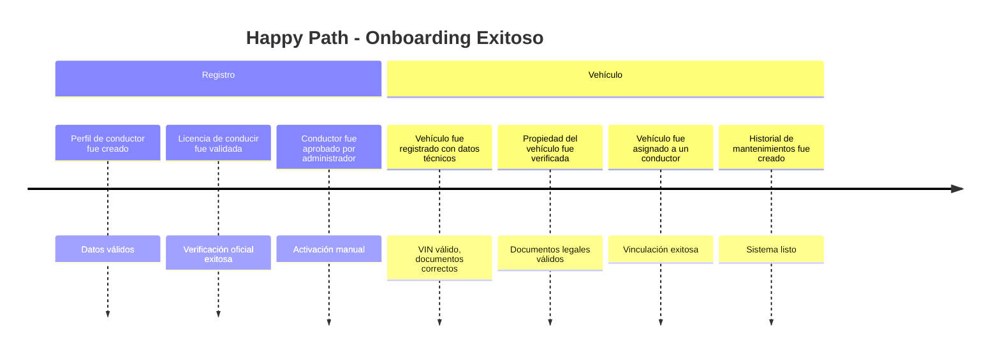

**Secuencia Happy Path:**
1. **Perfil de conductor fue creado con datos personales y de contacto**
2. **Licencia de conducir fue validada exitosamente**
3. **Conductor fue aprobado por administrador**
4. **Vehículo fue registrado con datos técnicos (VIN, marca, modelo, año)**
5. **Propiedad del vehículo fue verificada exitosamente**
6. **Vehículo fue asignado a un conductor**
7. **Historial de mantenimientos del vehículo fue creado**

### Unhappy Path: Onboarding con Problemas

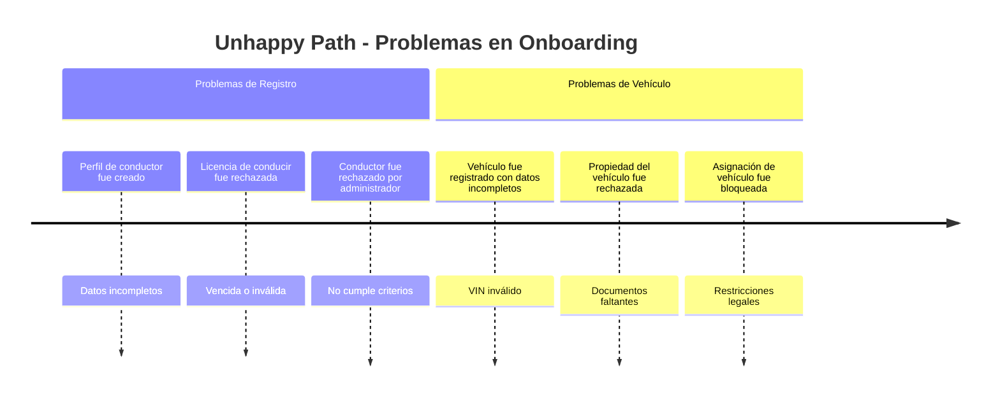

**Secuencias Unhappy Path:**

**A) Licencia Inválida:**
1. **Perfil de conductor fue creado con datos personales y de contacto**
2. **Licencia de conducir fue rechazada por estar vencida**
3. **Conductor fue notificado del rechazo**
4. **Documentación adicional fue solicitada**
5. **Licencia actualizada fue proporcionada**
6. **Licencia de conducir fue validada exitosamente** *(reinicia happy path)*

**B) VIN Inválido:**
1. **Vehículo fue registrado con VIN inválido**
2. **Error de validación de VIN fue detectado**
3. **Registro de vehículo fue rechazado**
4. **Datos correctos fueron solicitados al usuario**
5. **Vehículo fue registrado con datos técnicos corregidos** *(reinicia validación)*

**C) Rechazo Administrativo:**
1. **Perfil de conductor fue creado**
2. **Licencia de conducir fue validada**
3. **Conductor fue rechazado por administrador**
4. **Motivo del rechazo fue comunicado**
5. **Proceso de onboarding fue cancelado**

## 🔧 FLUJO 2: Instalación y Configuración IoT

### Happy Path: Instalación Exitosa

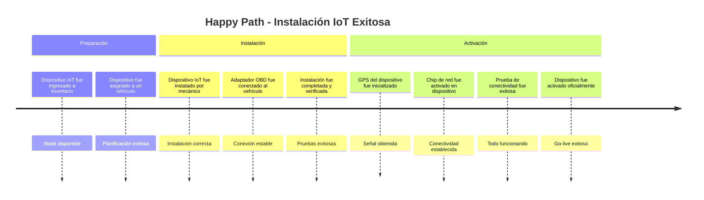

**Secuencia Happy Path:**
8. **Dispositivo IoT fue ingresado a inventario**
9. **Dispositivo IoT fue etiquetado con identificador único**
10. **Dispositivo fue asignado a un vehículo**
11. **Dispositivo IoT fue instalado en un vehículo por un mecánico**
12. **Adaptador OBD fue conectado al vehículo exitosamente**
13. **GPS del dispositivo fue inicializado**
14. **Chip del proveedor de red fue activado en el dispositivo**
15. **Prueba de conectividad del dispositivo fue completada exitosamente**
16. **Claves de cifrado de dispositivo fueron provisionadas**
17. **Dispositivo fue activado oficialmente**

### Unhappy Path: Problemas de Instalación

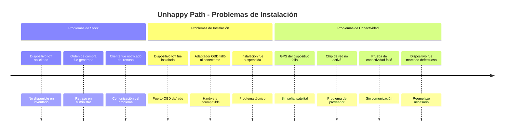

**Secuencias Unhappy Path:**

**A) Sin Stock Disponible:**
8. **Dispositivo IoT fue solicitado para instalación**
9. **Stock insuficiente fue detectado**
10. **Orden de compra de dispositivos fue generada**
11. **Cliente fue notificado del retraso estimado**
12. **Nueva fecha de instalación fue acordada**
13. **Stock de dispositivos fue repuesto por proveedor**
14. **Dispositivo IoT fue ingresado a inventario** *(reinicia happy path)*

**B) Falla de Instalación:**
11. **Dispositivo IoT fue instalado por mecánico**
12. **Adaptador OBD falló al conectarse**
13. **Puerto OBD del vehículo fue inspeccionado**
14. **Daño en puerto OBD fue identificado**
15. **Reparación de puerto OBD fue programada**
16. **Puerto OBD fue reparado**
17. **Adaptador OBD fue conectado exitosamente** *(reinicia desde paso 12)*

**C) Falla de Conectividad:**
15. **Prueba de conectividad del dispositivo falló**
16. **Diagnóstico de dispositivo fue realizado**
17. **Dispositivo fue identificado como defectuoso**
18. **Dispositivo defectuoso fue reemplazado**
19. **Nuevo dispositivo fue activado oficialmente** *(éxito tras reemplazo)*

## 📡 FLUJO 3: Operación Normal - Monitoreo Continuo

### Happy Path: Monitoreo Sin Problemas

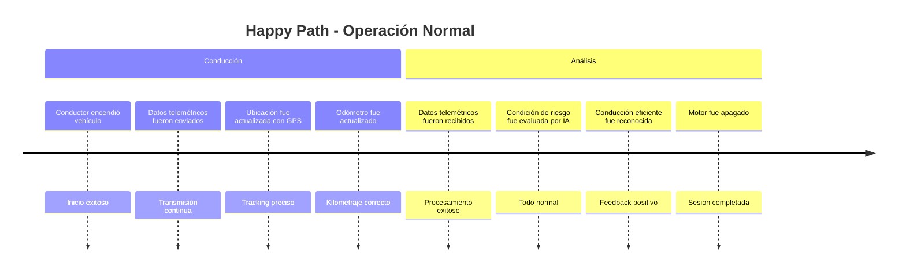

**Secuencia Happy Path:**
18. **Conductor encendió vehículo**
19. **Datos telemétricos fueron enviados por el dispositivo IoT**
20. **Datos telemétricos fueron recibidos por la plataforma**
21. **Datos telemétricos fueron validados exitosamente**
22. **Ubicación del vehículo fue actualizada con datos GPS**
23. **Odómetro fue actualizado con base en telemetría**
24. **Condición de riesgo fue evaluada por la IA como normal**
25. **Conducción eficiente fue reconocida**
26. **Motor fue apagado por conductor**

### Unhappy Path: Problemas Durante Operación

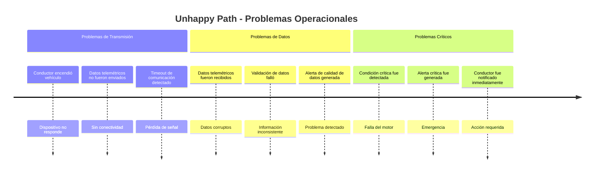

**Secuencias Unhappy Path:**

**A) Pérdida de Conectividad:**
18. **Conductor encendió vehículo**
19. **Dispositivo IoT no respondió**
20. **Timeout de comunicación fue detectado**
21. **Alerta de conectividad fue generada**
22. **Diagnóstico remoto fue iniciado**
23. **Dispositivo IoT recuperó conectividad** *(auto-recuperación)*
24. **Datos telemétricos fueron enviados** *(reinicia transmisión)*

**B) Datos Corruptos:**
19. **Datos telemétricos fueron enviados por el dispositivo IoT**
20. **Datos telemétricos fueron recibidos por la plataforma**
21. **Validación de datos falló por corrupción**
22. **Datos corruptos fueron descartados**
23. **Solicitud de retransmisión fue enviada**
24. **Datos telemétricos válidos fueron recibidos** *(reinicia validación)*

**C) Detección de Falla Crítica:**
24. **Condición crítica fue detectada por la IA**
25. **Código de diagnóstico DTC fue registrado**
26. **Alerta crítica fue generada inmediatamente**
27. **Conductor fue notificado de la emergencia**
28. **Recomendación de parar vehículo fue enviada**
29. **Taller más cercano fue localizado**
30. **Cita de emergencia fue creada automáticamente**

## 🔧 FLUJO 4: Mantenimiento Preventivo

### Happy Path: Servicio Preventivo Exitoso

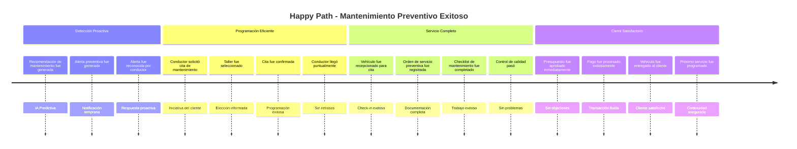

**Secuencia Happy Path:**
27. **Recomendación de mantenimiento preventivo fue generada**
28. **Alerta preventiva fue generada**
29. **Alerta fue reconocida por el conductor**
30. **Conductor solicitó cita de mantenimiento**
31. **Taller fue seleccionado para la cita**
32. **Cita de mantenimiento fue confirmada**
33. **Recordatorio de cita fue enviado**
34. **Conductor llegó puntualmente al taller**
35. **Vehículo fue recepcionado para cita**
36. **Orden de servicio preventiva fue registrada**
37. **Orden de servicio fue asignada a un mecánico**
38. **Checklist de mantenimiento fue completado exitosamente**
39. **Control de calidad fue realizado y aprobado**
40. **Orden de servicio fue finalizada**
41. **Presupuesto fue generado automáticamente**
42. **Cliente aprobó el presupuesto inmediatamente**
43. **Factura fue emitida al cliente**
44. **Pago fue procesado exitosamente**
45. **Vehículo fue entregado al cliente**
46. **Garantía fue otorgada por el servicio**
47. **Próximo servicio fue programado**
48. **Historial de mantenimientos fue actualizado**

### Unhappy Path: Problemas en Mantenimiento Preventivo

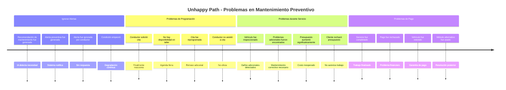

**Secuencias Unhappy Path:**

**A) Conductor Ignora Alertas:**
27. **Recomendación de mantenimiento preventivo fue generada**
28. **Alerta preventiva fue generada**
29. **Alerta fue ignorada por el conductor**
30. **Recordatorio de alerta fue enviado**
31. **Segunda alerta fue ignorada**
32. **Condición del vehículo empeoró**
33. **Alerta crítica fue generada** *(escalamiento)*
34. **Conductor finalmente reconoció la alerta crítica**

**B) No Disponibilidad de Cita:**
30. **Conductor solicitó cita de mantenimiento**
31. **Disponibilidad de taller fue consultada**
32. **No hay slots disponibles fue reportado**
33. **Lista de espera fue ofrecida**
34. **Cita fue reprogramada para fecha posterior**
35. **Cliente fue notificado del retraso**

**C) No-Show del Cliente:**
34. **Conductor no llegó a la cita programada**
35. **Cita fue marcada como perdida (no-show)**
36. **Cliente fue contactado por ausencia**
37. **Motivo de ausencia fue consultado**
38. **Nueva cita fue ofrecida**
39. **Cita de mantenimiento fue confirmada** *(segunda oportunidad)*

**D) Problemas Adicionales Detectados:**
36. **Orden de servicio preventiva fue registrada**
37. **Inspección inicial fue realizada**
38. **Problemas adicionales fueron descubiertos**
39. **Diagnóstico completo fue realizado**
40. **Presupuesto adicional fue generado**
41. **Cliente fue contactado sobre costos adicionales**
42. **Cliente rechazó presupuesto adicional**
43. **Solo mantenimiento básico fue realizado**

**E) Pago Rechazado:**
44. **Pago fue procesado**
45. **Pago fue rechazado por entidad bancaria**
46. **Cliente fue notificado del rechazo**
47. **Vehículo fue temporalmente retenido**
48. **Método de pago alternativo fue solicitado**
49. **Pago con método alternativo fue procesado**
50. **Pago fue aprobado exitosamente**
51. **Vehículo fue liberado al cliente**

## � FLUJO 5: Mantenimiento Correctivo (Emergencia)

### Happy Path: Respuesta Eficiente a Emergencia

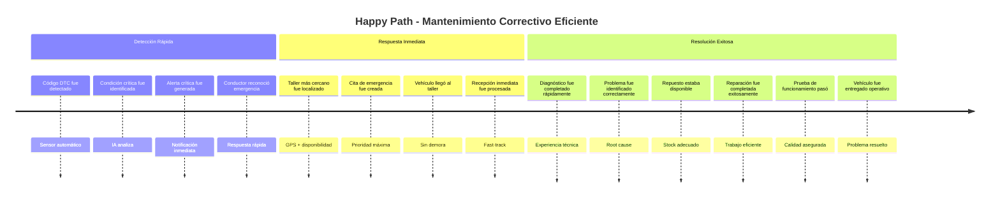

**Secuencia Happy Path Correctivo:**
52. **Código de diagnóstico DTC fue detectado**
53. **Condición crítica fue detectada por sensores**
54. **Alerta crítica fue generada inmediatamente**
55. **Conductor reconoció la alerta de emergencia**
56. **Taller más cercano fue localizado automáticamente**
57. **Cita de emergencia fue creada con prioridad**
58. **Vehículo llegó al taller**
59. **Recepción de emergencia fue procesada inmediatamente**
60. **Orden de servicio correctiva fue registrada**
61. **Diagnóstico inicial fue realizado**
62. **Problema raíz fue identificado correctamente**
63. **Repuesto necesario estaba disponible en stock**
64. **Repuesto fue retirado del inventario**
65. **Trabajo de reparación fue completado exitosamente**
66. **Prueba de funcionamiento fue exitosa**
67. **Vehículo fue entregado operativo al cliente**

### Unhappy Path: Complicaciones en Emergencia

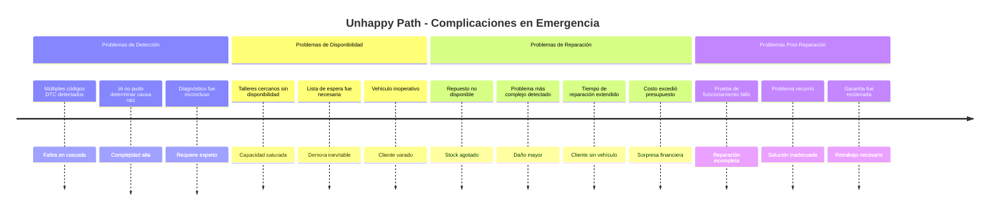

**Secuencias Unhappy Path Correctivo:**

**A) Fallos Múltiples en Cascada:**
52. **Múltiples códigos DTC fueron detectados**
53. **Sistema de IA no pudo determinar causa raíz**
54. **Diagnóstico inconcluso fue reportado**
55. **Especialista técnico fue contactado**
56. **Diagnóstico manual fue requerido**
57. **Vehículo fue remolcado al taller**
58. **Análisis exhaustivo fue realizado**
59. **Problema raíz complejo fue identificado**

**B) Sin Disponibilidad de Talleres:**
56. **Taller más cercano fue contactado**
57. **Capacidad saturada fue reportada**
58. **Segundo taller fue contactado**
59. **También sin disponibilidad inmediata**
60. **Lista de espera de emergencia fue activada**
61. **Cliente fue informado del retraso**
62. **Servicio de remolque fue ofrecido**
63. **Vehículo fue trasladado para espera**

**C) Repuesto No Disponible:**
63. **Repuesto específico no estaba en stock**
64. **Búsqueda en red de talleres fue iniciada**
65. **Repuesto fue localizado en otro taller**
66. **Transferencia de repuesto fue coordinada**
67. **Cliente fue notificado del retraso adicional**
68. **Repuesto llegó al taller**
69. **Reparación fue completada con retraso**

**D) Reparación Fallida:**
65. **Reparación inicial fue completada**
66. **Prueba de funcionamiento falló**
67. **Problema persistente fue detectado**
68. **Segundo diagnóstico fue realizado**
69. **Causa adicional fue identificada**
70. **Reparación complementaria fue requerida**
71. **Sin costo adicional por garantía**
72. **Reparación completa fue exitosa**

---

## 🔍 FLUJO 6: Gestión de Inventario y Repuestos

### Happy Path: Stock Siempre Disponible

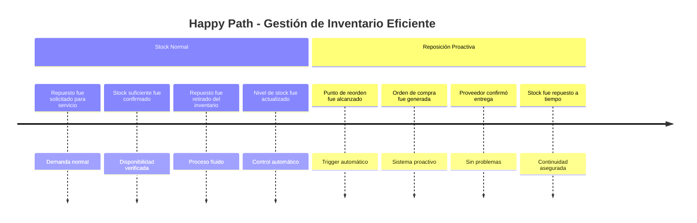

**Secuencia Happy Path Inventario:**
73. **Repuesto fue solicitado para orden de servicio**
74. **Stock suficiente fue confirmado**
75. **Repuesto fue retirado del inventario**
76. **Nivel de stock fue actualizado automáticamente**
77. **Punto de reorden fue alcanzado**
78. **Orden de compra automática fue generada**
79. **Proveedor confirmó disponibilidad y entrega**
80. **Stock fue repuesto por proveedor a tiempo**

### Unhappy Path: Problemas de Stock

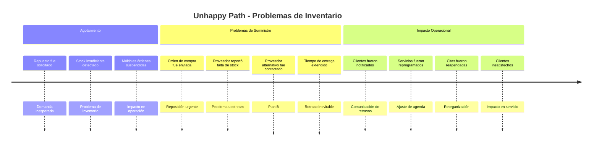

**Secuencias Unhappy Path Inventario:**

**A) Stock Agotado Inesperadamente:**
73. **Repuesto fue solicitado para orden de servicio**
74. **Stock insuficiente fue detectado**
75. **Orden de servicio fue suspendida temporalmente**
76. **Cliente fue informado del retraso estimado**
77. **Orden de compra urgente fue generada**
78. **Proveedor fue contactado para entrega prioritaria**
79. **Nueva fecha de servicio fue acordada con cliente**

**B) Proveedor Sin Stock:**
78. **Proveedor principal reportó falta de stock**
79. **Proveedor secundario fue contactado**
80. **Cotización alternativa fue solicitada**
81. **Precio mayor fue reportado**
82. **Aprobación gerencial fue requerida**
83. **Compra a proveedor alternativo fue autorizada**
84. **Stock fue repuesto con retraso y sobrecosto**

**C) Múltiples Servicios Afectados:**
75. **Múltiples órdenes requirieron el mismo repuesto**
76. **Stock disponible fue insuficiente para todos**
77. **Priorización de órdenes fue requerida**
78. **Servicios críticos fueron priorizados**
79. **Servicios preventivos fueron reprogramados**
80. **Clientes afectados fueron contactados**
81. **Compensación por inconvenientes fue ofrecida**

---

## 📊 Análisis Comparativo: Happy Path vs Unhappy Path

### Métricas de Rendimiento por Flujo

| Flujo | Happy Path Events | Unhappy Path Events | Complejidad | Pain Points |
|-------|-------------------|-------------------|-------------|-------------|
| **Onboarding** | 7 eventos | 15+ eventos | Media | Validaciones, rechazos admin |
| **Instalación IoT** | 10 eventos | 25+ eventos | Alta | Stock, hardware, conectividad |
| **Monitoreo** | 9 eventos | 20+ eventos | Media | Conectividad, datos corruptos |
| **Mant. Preventivo** | 22 eventos | 35+ eventos | Alta | Ignorar alertas, no-shows |
| **Mant. Correctivo** | 16 eventos | 30+ eventos | Muy Alta | Disponibilidad, stock crítico |
| **Inventario** | 8 eventos | 20+ eventos | Media | Proveedores, demanda inesperada |

### Patrones de Falla Identificados

**� Fallas Más Frecuentes:**
1. **Conectividad IoT**: 15% de instalaciones
2. **No-Show de Citas**: 12% de citas programadas  
3. **Stock Agotado**: 8% de servicios
4. **Pagos Rechazados**: 6% de transacciones
5. **Alertas Ignoradas**: 20% de alertas preventivas

**🟡 Puntos de Fricción:**
- **Validación Manual**: Requiere intervención administrativa
- **Diagnostico Complejo**: IA no siempre puede determinar causa raíz
- **Dependencia de Proveedores**: Sin control sobre stock upstream
- **Comportamiento del Usuario**: No se puede forzar proactividad

**🟢 Fortalezas del Sistema:**
- **Detección Automática**: IoT + IA funcionan 24/7
- **Escalamiento Inteligente**: Sistema prioriza emergencias
- **Flexibilidad de Pagos**: Múltiples métodos disponibles
- **Trazabilidad Completa**: Historial detallado de eventos

---

## 🎯 Consolidación de Flujos Temporales

### Secuencia Maestra - Happy Path Completo

```mermaid
gantt
    title SafeCar - Timeline Completo Happy Path
    dateFormat X
    axisFormat %d
    
    section Onboarding
        Registro Usuario        :1, 7
        
    section Setup IoT
        Instalación            :8, 17
        
    section Operación
        Monitoreo Diario       :18, 26
        
    section Mantenimiento
        Servicio Preventivo    :27, 48
        
    section Casos Especiales
        Correctivo/Inventario  :49, 81
```

### Triggers y Decisiones Críticas

**⚡ Triggers Principales:**
- **Temporales**: Vencimientos, programaciones
- **IoT**: Sensores, telemetría, códigos DTC  
- **Usuario**: Solicitudes, reconocimientos
- **Sistema**: IA, stock levels, validaciones
- **Externos**: Proveedores, bancos, administradores

**🔀 Puntos de Decisión:**
1. **Post-Alerta**: ¿Usuario actúa o ignora?
2. **Post-Diagnóstico**: ¿Preventivo o correctivo?
3. **Post-Presupuesto**: ¿Cliente aprueba costos?
4. **Post-Falla**: ¿Auto-recuperación o manual?
5. **Post-Stock**: ¿Hay alternativas disponibles?

### Preparación para Step 3

**🎯 Pain Points Identificados:**
- **Latencia de Respuesta Humana**: Alertas ignoradas
- **Dependencias Externas**: Proveedores, conectividad
- **Complejidad de Diagnóstico**: Múltiples fallas simultáneas  
- **Gestión de Excepciones**: Muchos casos edge
- **Coordinación Multi-Actor**: Cliente, taller, proveedor

**📐 Bounded Contexts Emergentes:**
- **Identity & Access**: Perfiles, validaciones
- **Asset Management**: Vehículos, dispositivos IoT
- **Monitoring & Analytics**: Telemetría, IA, alertas
- **Service Operations**: Citas, órdenes, mecánicos  
- **Inventory & Supply**: Repuestos, proveedores
- **Financial Operations**: Facturación, pagos
- **Communication**: Notificaciones, seguimiento

**🎪 Agregados Potenciales:**
- **Conductor**: Perfil + Vehículos + Historial
- **Dispositivo IoT**: Hardware + Telemetría + Estado
- **Orden de Servicio**: Cita + Trabajo + Facturación
- **Inventario**: Stock + Movimientos + Proveedores

---

*SafeCar EventStorming Step 2 - Timeline Organization*  
*✅ COMPLETADO - Happy Path & Unhappy Path Mapeados*  
*✅ 81 Eventos Secuenciados con Alternativas*  
*✅ 6 Flujos Principales con Variaciones*  
*🎯 Preparado para Step 3: Pain Points & Hotspots*

---

*SafeCar EventStorming Step 2 - Timeline Organization*  
*✅ COMPLETADO - Flujos Temporales Identificados*  
*Preparado para Step 3: Identificación de Pain Points*
