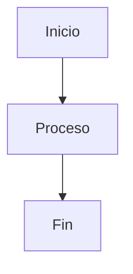

# Guía de Implementación - Sistema de Decisiones Visita Domiciliaria

## Resumen Ejecutivo

El sistema desarrollado proporciona un marco estructurado y cuantificable para la evaluación de visitas domiciliarias, basado en:

- **Sistema de puntuación ponderado** (0-100 puntos)
- **Reglas de eliminación automática** para casos críticos
- **Clasificación por niveles de observación** (ALTO/MEDIO)
- **Tres resultados posibles**: CONFORME, OBSERVADO, RECHAZADO

## Archivos del Sistema

| Archivo | Propósito | Audiencia |
|---------|-----------|-----------|
| `flujo_decisiones_visita_domiciliaria.md` | Documento principal con reglas completas | Todos los usuarios |
| `arbol_decision_visual.md` | Representación visual en ASCII | Capacitación y referencia |
| `diagramas_mermaid.md` | Diagramas interactivos para web | Documentación digital |
| `diagramas_plantuml.md` | Diagramas profesionales | Presentaciones ejecutivas |
| `calculadora_puntuacion.md` | Herramienta práctica de evaluación | Verificadores de campo |
| `guia_implementacion.md` | Este archivo - guía de adopción | Gerencia y supervisores |

## Implementación por Fases

### Fase 1: Capacitación (Semanas 1-2)
**Objetivo**: Entrenar al equipo en el nuevo sistema

**Actividades**:
- [ ] Presentación del sistema a supervisores
- [ ] Capacitación de verificadores con casos de prueba
- [ ] Revisión de herramientas y documentos
- [ ] Pruebas piloto con 10-15 casos reales

**Entregables**:
- Manual de usuario impreso
- Videos de capacitación
- Casos de estudio resueltos

### Fase 2: Implementación Piloto (Semanas 3-4)
**Objetivo**: Validar el sistema en condiciones reales

**Actividades**:
- [ ] Ejecutar 50+ evaluaciones con el nuevo sistema
- [ ] Comparar resultados con método anterior
- [ ] Recopilar feedback de verificadores
- [ ] Ajustar criterios si es necesario

**Métricas de éxito**:
- Consistencia >90% entre verificadores
- Tiempo de evaluación <20% adicional
- Satisfacción del equipo >80%

### Fase 3: Despliegue Completo (Semanas 5-6)
**Objetivo**: Adopción total del sistema

**Actividades**:
- [ ] Migrar todos los casos al nuevo sistema
- [ ] Establecer procesos de control de calidad
- [ ] Crear reportes de gestión automatizados
- [ ] Documentar lecciones aprendidas

### Fase 4: Optimización (Mes 2+)
**Objetivo**: Mejora continua

**Actividades**:
- [ ] Análisis de datos históricos
- [ ] Refinamiento de pesos y criterios
- [ ] Automatización de cálculos
- [ ] Integración con sistemas existentes

## Herramientas de Visualización

### Para Presentaciones Ejecutivas
**Recomendado**: PlantUML
- Diagramas profesionales
- Fácil integración en PowerPoint
- Ideal para stakeholders senior

### Para Documentación Web
**Recomendado**: Mermaid
- Renderizado automático en GitHub/GitLab
- Interactivo y responsive
- Ideal para wikis corporativas

### Para Capacitación
**Recomendado**: ASCII + Ejemplos prácticos
- Fácil de imprimir y distribuir
- No requiere herramientas especiales
- Ideal para manuales de campo

## Configuración de Herramientas Visuales

### Opción A: GitHub/GitLab (Recomendado)
```markdown
# En cualquier archivo .md

```

### Opción B: VS Code con Extensiones
1. Instalar extensión "Mermaid Preview"
2. Instalar extensión "PlantUML"
3. Abrir archivos .md y usar Ctrl+Shift+V

### Opción C: Herramientas Online
- **Mermaid Live**: https://mermaid.live/
- **PlantUML Online**: http://www.plantuml.com/plantuml/
- **Draw.io**: https://app.diagrams.net/

### Opción D: Generación de Imágenes
```bash
# Para Mermaid
npm install -g @mermaid-js/mermaid-cli
mmdc -i diagrama.mmd -o diagrama.png

# Para PlantUML  
java -jar plantuml.jar diagrama.puml
```

## Casos de Uso por Rol

### Verificador de Campo
**Herramientas principales**:
- `calculadora_puntuacion.md` (versión impresa)
- App móvil (desarrollo futuro)
- Cámara para evidencias

**Flujo de trabajo**:
1. Llenar hoja de evaluación en sitio
2. Calcular puntuación paso a paso
3. Determinar estado según reglas
4. Documentar observaciones y recomendaciones

### Supervisor de Área
**Herramientas principales**:
- `flujo_decisiones_visita_domiciliaria.md` (referencia completa)
- Dashboard de métricas (desarrollo futuro)
- Reportes de calidad

**Responsabilidades**:
1. Revisar casos OBSERVADO y RECHAZADO
2. Validar aplicación correcta de reglas
3. Aprobar mitigaciones propuestas
4. Mantener consistencia en el equipo

### Gerencia
**Herramientas principales**:
- Diagramas PlantUML para presentaciones
- Reportes ejecutivos con KPIs
- Análisis de tendencias

**Decisiones estratégicas**:
1. Ajustar pesos según experiencia
2. Modificar umbrales de puntuación
3. Añadir nuevos criterios de evaluación
4. Optimizar procesos operativos

## Métricas de Monitoreo

### Métricas Operacionales
- **Tiempo promedio por evaluación**: Meta <45 minutos
- **Casos completados por día por verificador**: Meta >8
- **Porcentaje de casos que requieren revisión**: Meta <15%

### Métricas de Calidad
- **Consistencia entre verificadores**: Meta >90%
- **Casos apelados exitosamente**: Meta <5%
- **Satisfacción del cliente**: Meta >85%

### Métricas de Negocio
- **Distribución de resultados**:
  - CONFORME: 60-70%
  - OBSERVADO: 20-25%
  - RECHAZADO: 10-15%
- **Tiempo de ciclo total**: Meta <72 horas
- **Costo por evaluación**: Reducir 15% vs método anterior

## Mantenimiento del Sistema

### Revisión Mensual
- [ ] Análisis de casos edge
- [ ] Feedback de verificadores
- [ ] Calibración de criterios
- [ ] Actualización de documentación

### Revisión Trimestral
- [ ] Análisis estadístico de resultados
- [ ] Benchmarking con competidores
- [ ] Evaluación de nuevas tecnologías
- [ ] Planificación de mejoras

### Revisión Anual
- [ ] Revisión completa de pesos y umbrales
- [ ] Análisis de ROI del sistema
- [ ] Planificación estratégica
- [ ] Actualización de herramientas

## Riesgos y Mitigaciones

| Riesgo | Probabilidad | Impacto | Mitigación |
|--------|--------------|---------|------------|
| Resistencia al cambio | Media | Alto | Capacitación intensiva + incentivos |
| Inconsistencia en aplicación | Alta | Medio | Supervisión cercana + calibración |
| Sobrecarga de documentación | Media | Medio | Digitalización + automatización |
| Cambios regulatorios | Baja | Alto | Flexibilidad en diseño + actualizaciones rápidas |

## Roadmap de Evolución

### Corto Plazo (3-6 meses)
- [ ] App móvil para calculadora
- [ ] Integración con sistema CRM
- [ ] Reportes automatizados
- [ ] Base de datos de casos históricos

### Mediano Plazo (6-12 meses)
- [ ] Machine Learning para scoring automático
- [ ] Integración con mapas y datos geográficos
- [ ] API para terceros
- [ ] Dashboard en tiempo real

### Largo Plazo (12+ meses)
- [ ] Inteligencia artificial para detección de patrones
- [ ] Integración con IoT para verificación automática
- [ ] Blockchain para inmutabilidad de registros
- [ ] Predictive analytics para riesgo

---

## Contactos del Proyecto

**Líder del Proyecto**: [Nombre]
**Email**: [email@empresa.com]
**Teléfono**: [+XX XXX XXX XXX]

**Soporte Técnico**: [Nombre]
**Email**: [soporte@empresa.com]

**Capacitación**: [Nombre]
**Email**: [capacitacion@empresa.com]

---

*Este documento debe actualizarse regularmente para reflejar cambios en el sistema y lecciones aprendidas durante la implementación.*
